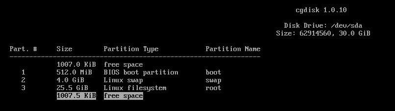
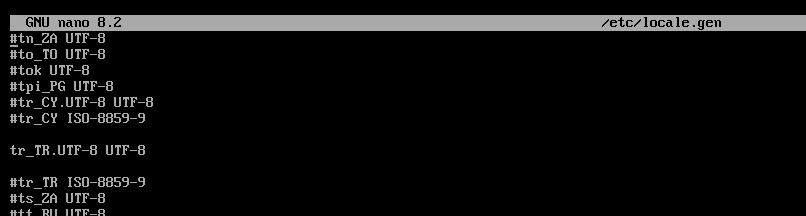

# VirtualBox Üzerine Arch Linux Kurulumu

VirtualBox sanal makine üzerine adım adım Arch Linux kurulumu yapıyoruz. Bu sayfanın hazırlanmasında [Arch Linux Installation Guide (Türkçe)](https://wiki.archlinux.org/title/Installation_guide_(T%C3%BCrk%C3%A7e)) sayfasından faydalınılmıştır.

## Ön Hazırlıklar

### ISO Dosyası İndirme

[İndirme](https://archlinux.org/download/) sayfasından son Arch Linux ISO dosyasını indiriniz.

### VirtualBox Sanal Makine Özellikleri

Aşağıdaki özelliklerde bir sanal makine oluşturup indirilen ISO kalıbı yerleştirilip makineyi başlatınız.

* 4GB Ram
* 4 Çekirdek işlemci
* 30GB Disk alanı
* Efi etkinleştirme: True


### Klavye ayarları

Varsayılan dil İngilizce olduğu için öncelikle klavye düzenini Türkçe-Q klavye olarak ayarlayalım.

```
loadkeys trq
```
### Sistem saati ayarı
Sistem saatinin senkronize olduğunu sağlamak için `timedatectl` komutu kullanılır. `set-timezone` parametresi ile saat dilimini İstanbul olarak ayarlayalım.
```
timedatectl set-timezone Europa/Istanbul
```
### Disk Bölümleme
Sistemin kurulacağı disk bölümünü oluşturmadan önce `lsblk` komutu ile mevcut yapıyı bir görelim.


`sda` isimli disk bizim sanal makineye verdiğimiz 30GB'lık bölümü temsil ediyor. Burayı bölümleyerek disk yapısını ayarlayalım. Bunun için `cgdisk` aracını kullanalım.

```
cgdisk /dev/sda
```
`Press anykey to continue...` yazısını `Enter` tuşu ile geçip bölümleme ekranına geçiyoruz. Sırasıyla aşağıdaki özelliklerde 3 adet bölüm oluşturuyoruz:

| Boyut  | Bağlantı Noktası | Bölüm    | Bölüm Tipi |
|-------:|------------------|----------|------------|
| 512 MB | /boot            |/dev/sda1 | Boot Efi   |
|   4 GB | [Swap]           |/dev/sda2 | Linux Swap |
| 25.5 GB| /                |/dev/sda3 | Linux x86-64 kök dizini (/)  |


1. **Boot:** [ ` New  `]
    - First Sector: (Boş geçiyoruz)
    - Size in sectors: `512M`
    - Hex Code or GUID: `ef02`
    - Enter new partition name: `boot`
2. **Swap:** [ ` New  `]
    - First Sector: (Boş geçiyoruz)
    - Size in sectors: `4G`
    - Hex Code or GUID: `8200`
    - Enter new partition name: `swap`
3. **Root:** [ ` New   `]
    - First Sector: (Boş geçiyoruz)
    - Size in sectors: (Kalan tüm alanı kullanmak için boş geçiyoruz)
    - Hex Code or GUID: `8300`
    - Enter new partition name: `root`
4. [ ` Write  `]
    - Are you sure?: `yes`
5. [ ` Quit  `]

Bu işlemlerin sonunda aşağıdaki görüntü oluşmaktadır:



### Bölüm Biçimlendirme

`lsblk` komutu ile diskin son durumuna bakıp, yukarıda oluşturduğumuz her bir bölümü teker teker biçimlendirelim.


1. **Boot Efi** bölümünü biçimlendirelim:
```
mkfs.fat -F 32 /dev/sda1
```

2. **Takas** bölümünü swap olarak ayarlayalım:
```
mkswap /dev/sda2
```

3. **Kök** bölümünü biçimlendirelim:
```
mkfs.ext4 /dev/sda3
```

### Dosya Sistemlerini Disk Bölümlerine Bağlama

Oluşturduğumuz disk bölümlerine uygun dosya sistemlerini bağlayalım.

> [!WARNING]
> Burada sıralama önemli. Önce kök (/) bölümünü bağlayıp sonra boot bağlamak gerekiyor. Aksi halde boot için yapılan mount işlemi düzgün çalışmıyor.

1. **root** bölümünü `/mnt` klasörüne bağlayalım:
```
# mount /dev/sda3 /mnt
```
2. **boot** bölümünü yeni bir klasör açıp oraya bağlayalım:
```
mkdir -p /mnt/boot/efi
mount /dev/sda1 /mnt/boot/efi
```
3. **swap** bölümünü etkinleştirelim:
```
swapon /dev/sda2
```
Son durumu yine `lsblk' ile kontrol ediyoruz. Sonuç aşağıdaki gibi olmalıdır:


## Kurulum

### Temel Paketleri Yükleme

Temel Linux çekirdeği ve bazı konfigürasyonlar için gereken paketleri kuralım:

```
pacstrap -K /mnt base linux linux-firmware nano networkmanager
```

### Fstab

Bir fstab dosyası oluşturarak disk yapısını burada saklayalım. UUIDleri veya etiketleri tanımlamak için -U veya -L bayraklarını kullanılır.
```
genfstab -U /mnt >> /mnt/etc/fstab
```

### Yeni Sisteme Giriş

`arch-chroot` komutu ile yeni kurulan sistemin köküne geçiş yapalım:
```
arch-chroot /mnt
```

### Yeni Sistemin Zaman Ayarı
Zaman dilimini `İstanbul` olarak ayarlayalım:
```
ln -sf /usr/share/zoneinfo/Europe/Istanbul /etc/localtime
```
Ayarladığımız zaman dilimine uygun `/etc/adjtime` dosyasını oluşturmak için `hwclock` komutunu çalıştıralım:
```
hwclock --systohc
```

### Yerelleştirme

Temel paketleri kurarken metin editörü olarak kurduğumu `nano`'yu kullanarak  `/etc/locale.gen` dosyasını açıp `tr_TR.UTF-8 UTF-8` yerel bölge ifadesinin yorum karakterini (# sembolü) silelim. 

```
nano /etc/locale.gen
```



Ardından sistem yerelleştirme ayarlarını şu komut ile oluşturalım:
```
locale-gen
```

`locale.conf` dosyasını oluşturup `LANG` değişkenini Türkçe dili için tanımlayalım:
```
nano /etc/locale.conf
----------------------
LANG=tr_TR.UTF-8
```

`vconsole.conf` dosyasını düzenleyerek klavye düzenini değiştirelim ve bu düzeni kalıcı hâle getirelim:
```
nano /etc/vconsole.conf
---------------------
KEYMAP=trq
```

### Ağ yapılandırması

hostname doyasını oluşturup bilgisayar adını ayarlayın:
```
nano /etc/hostname
-----------------------
bilgisayar_adiniz
```

### Initramfs

Yeni initramfs oluşturmak genellikle gerekli değildir çünkü pacstrap ile sistem çekirdeği yüklenirken mkinitcpio çalıştırılır ve initramfs oluşturulur. Ama yine de oluşturmak isterseniz aşağıdaki komutu kullanabilirsiniz:

```
mkinitcpio -P
```

### Kullanıcı Tanımlamaları

İlk önce `passwd` komutu ile kök kullanıcı şifresini ayarlayalım:
```
passwd
```

Ardından `useradd` komutu ile yeni bir kullanıcı tanımlıyoruz. Bu kullanıcı için `passwd` komutu ile bir şifre belirliyoruz. Burada kendi adınızı yazabilirsiniz:
```
useradd -m ahmet
passwd ahmet
```
`sudo` kurulumunu (varsa güncellemesini) yapalım.

```
pacman -Sy sudo
```
Oluşturduğumuz kullanıcıya admin yetkisi verebilmek için `visudo` dosyasını açıp güncelleyelim:

```
nano /etc/sudoers
``` 
Dosya içinde `root ALL=(ALL:ALL) ALL` satırını bulup hemen altına yeni kullanıcı için aynı satırı ekleyip dosyayı kaydediyoruz.
```
root ALL=(ALL:ALL) ALL
ahmet ALL=(ALL:ALL) ALL
```
### Yeni Sistemi İnternete Bağlama
Daha önce kurduğumuz `networkmanager` paketini kullanarak ağ ayarlamalarını yapalım:

```
systemctl enable NetworkManager
```

### Önyükleyici Kurulumu

> [!WARNING]
> Öncelikle `lsblk` ile disk bölümlerinin doğru bağlandığından emin olalım. Eğer sda1 bağlı değil ise `mount /dev/sda1 /boot/efi` komutu ile bağlamanız gerekebilir.

Ön yükleyici için `Grub` kurulumu ve tanımlamalarını yapalım:
```
pacman -S grub efibootmgr
grub-install /dev/sda
grub-mkconfig -o /boot/grub/grub.cfg
```

### Çıkış ve Yeniden Başlatma
Kurulumu tamamladık. Sistemden çıkış yapıp bağlı diskleri ayıralım. Sonrasında sistemi yeniden başlatıp yeni kurulu Arch Linux sistemimize giriş yapalım.

> [!IMPORTANT]
> Yeniden başlatmadan hemen öncebağlı iso dosyasını ayırmayı unutmayalım.

```
exit
umount -a
reboot
```

## KDE Plasma Kurulumu
Masaüstü ortamlarından biri olan KDE Plasma kurulumu için aşağıdaki komutu çalıştıralım:
```
sudo pacman -S plasma sddm
```

Birkaç ek paket daha kuralım. Sonra işimize lazım olabilir.
```
sudo pacman -S konsole kate
```
Son olarak açılışta grafik arayüzün gelebilmesi olabilmesi için `sddm` ayarlarını aktif edelim
```
sudo systemctl enable sddm
```
Eğer hemen grafik arayüzünü başlatmak istiyorsanız `--now` parametresi ile aynı komutu yeniden çalıştıralım:
```
sudo systemctl enable --now sddm
```

Kullanıcı şifremizi girdikten sonra sistemimiz hazır!

